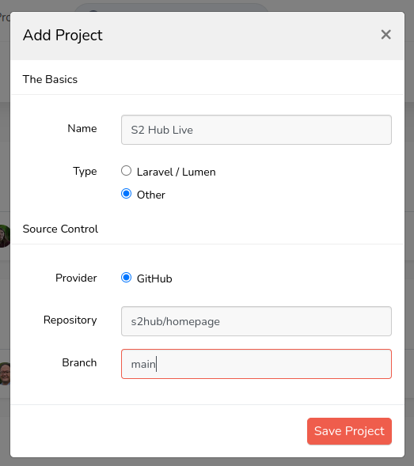
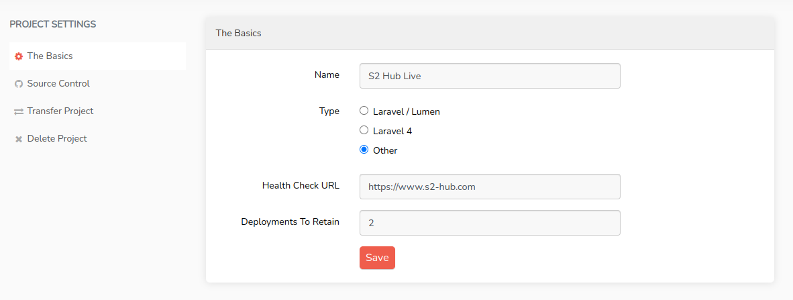
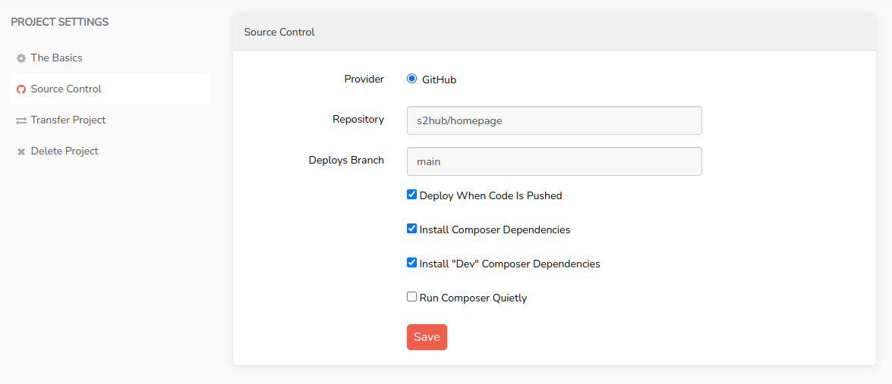
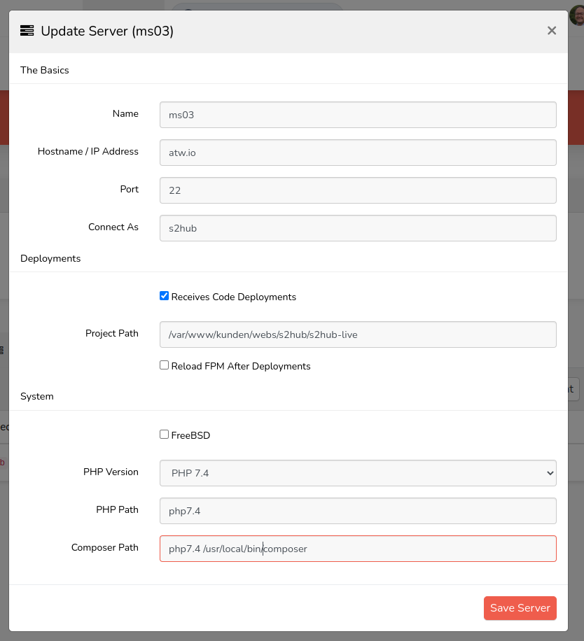
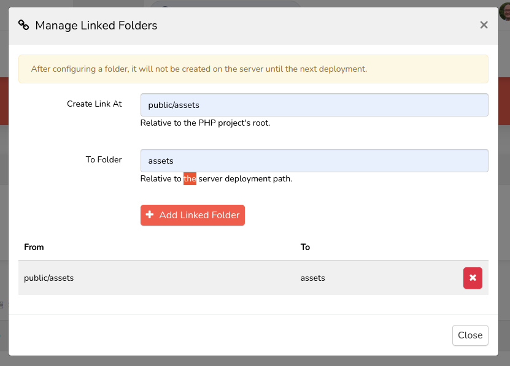
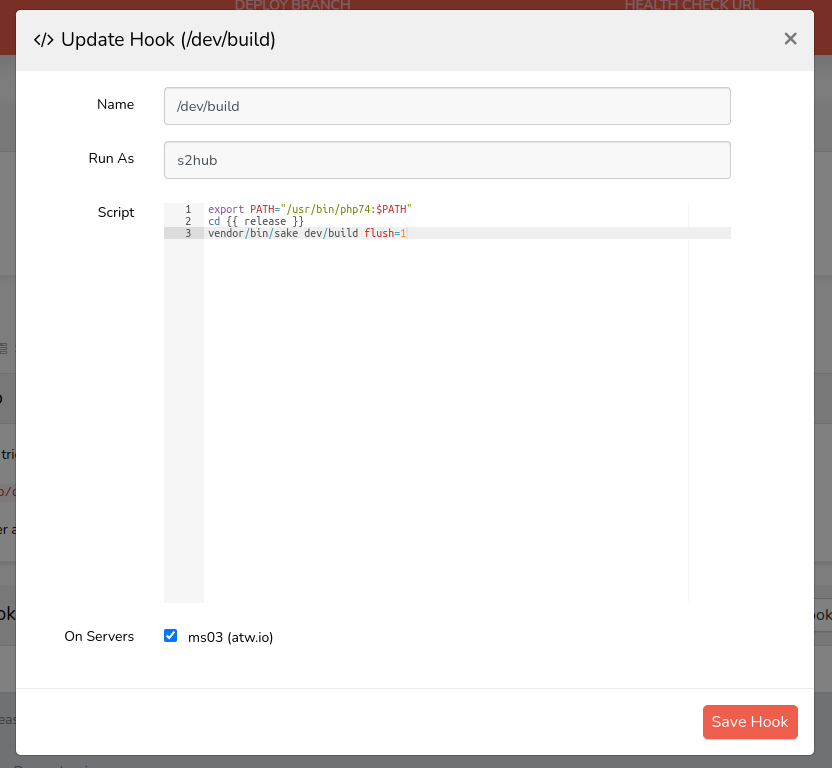

# Using Envoyer with Silverstripe CMS

## Introduction

[Envoyer](https://envoyer.io/) is originally a Laravel product, but it can be used to deploy any PHP project. 
We are using it because it is easy to use and reasonably priced, especially if you have many projets.

A disadvantage is limited team management. You can share projects with other Envoyer users, but only single projects. 
That makes it difficult to share all projects with a new employee.

## Requirements

Envoyer is perfect, if you are already using git-based deployments with composer. To use it, you need the possibility
to login via SSH with key authentication. The deployments are run on the server, so you need git, php and composer
on the server.

We learned, that you also need a writable home folder. Envoyer just writes a lock file, but the path is not configurable.
On one of our hosting providers, it is not possible to write in the home folder and there is no way to bypass this 
requirement - so Envoyer is not usable here. 

You also need one of these GIT-Providers:

- GitHub
- Bitbucket
- GitLab
- Self-Hosted GitLab

## Server preparation

### Folder structure

Envoyer uses the following directory structure, similar to Deployer:

- releases: One folder per release
- current: Link on the active release
- assets: Shared between deployments

The Silverstripe CMS .env file we put into the releases folder. Envoyer also provides an online management of the
environment file, but we don't use it.

## New project

### Create project

To add a new project, you first have to provide the repository informations and the branch you want to deploy. Select
"Other" as the project type, otherwise Envoyer will try to use artisan commands.

We only tested GitHub. With Github you need administrative permissions, editing permissions are not enough for
Envoyer to put up the hook to enable automatic deployments. To enable Git-providers, you have to setup them in the
general settings.

If your organization has third-party restrictions enabled, the organization's owner will need to approve the 
integration. This can be done using the following link: 

https://github.com/settings/connections/applications/94f9ec2a8d84cbc725e2

### Project settings

After creating the project, you have to make some project settings.

In "The Basics", you can set a "Health Check URL". This is an URL Envoyer will check after the deployment. 
The "Deployments to Retain" are the number of deployments Envoyer will keep so that you can redeploy them fast. Beware
that they will take server state so don't set the number too high.

In "Source Control", you have to check "Deploy When Code is Pushed". With this option,
the deployment is run when the given branch is updated, which is what we want.

### Project overview

Now you have the project overview with these tabs:

- Deployments (empty right now)
- Servers (see below)
- Deployment hooks (see below)
- Heartbeats: Monitoring for cron jobs (we don't use this feature)
- Notifications: Add notifications via Slack, Teams, Discord or Email
- Collaborateurs: Add permissions to other people

### Server settings

Now you can configure your server. Most important are the (ssh) user and project path. On our servers,
"Reload FPM" will not work the way Envoyer tries to do it, so we configure a hook for it.

Also, we have different PHP versions on the server, so the PHP path is not just "php", but "php7.4" or "php8.0".
To start composer with a different php version, you have to set the full path, in our case "php7.4 /usr/local/bin/composer"

After setting the server settings, you need to allow Envoyer to connect to the server. Click on the Key-Icon on the
right, copy the key and paste it into the file "~/.ssh/authorized_keys" in the user folder of the user, you are using.

### Linked folders 

On the tab "Deployment hooks" you can add everything that should happen after besides the standard Envoyer actions.

Before configuring the hooks, we define "linked folders". These are folders which are shared between deployments. The
most important one is "assets", but we also often link "node_modules" (to speed up the frontend build). To keep
"silverstripe-cache" is not a good idea, we tried that. The folder you are linking has to exist in the project folder.

### Deployment hooks

The standard Envoyer actions are:

- Clone new release
- Install composer dependencies
- Activate New Release
- Purge Old Releases

You can configure hooks and move them around where they should be executed. In our projects, we build the frontend
code on the server and use these steps:

- Clone new release
- Install composer dependencies
- Build Frontend
- /dev/build
- Activate New releases
- Purge Old Releases
- Reload apache

The configuration of a hook is straightforward: Just write a script - everything is possible. You have to select your
server on the bottom of the form.

This is our standard dev/build-Hook: We set the PHP-Version, switch to the release directory and run dev/build. You
have to select your server definition on the bottom, this allows for different hooks on multi-server deployments.

## Conclusion

Now you just have to click "Deploy", future commits will trigger deployments. This guide covers just the basics,
very interesting are the integrations for notifications.